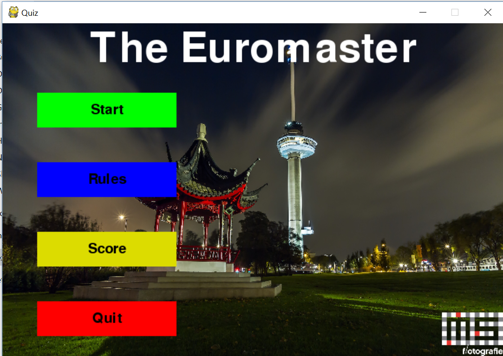
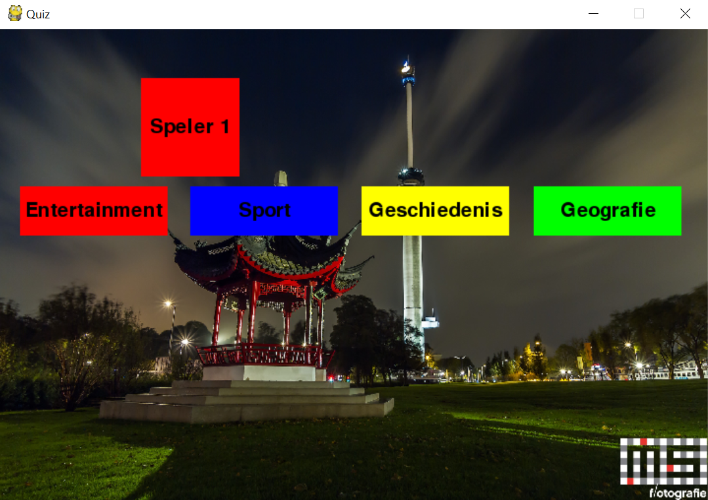
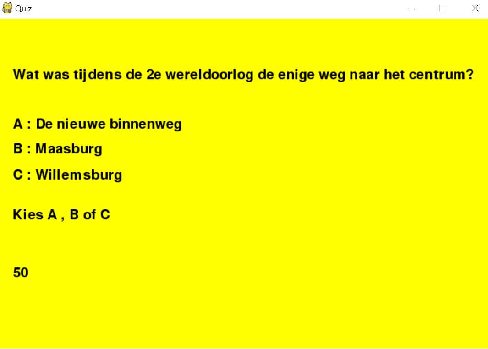
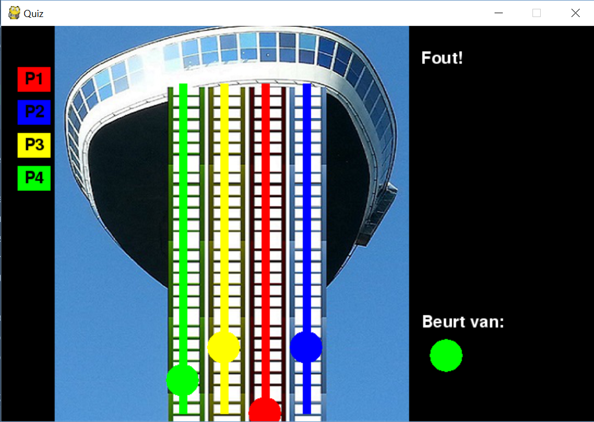

## The Euromaster Game

Pygame project made during the first year of the Computer Science programme at the Rotterdam University of Applied Sciences.

## Screenshots

<table>
    <tr>
        <td>
            
        </td>
        <td>
            
        </td>
    </tr>
</table>

<table>
    <tr>
        <td>
            
        </td>
        <td>
            
        </td>
    </tr>
</table>

## Details

The game is a quiz based on climbing the famous Euromast Tower in Rotterdam. Each player chooses a category of questions, and if answered correctly, advances upward. The amount of steps travelled upward is determined by a dice-roll. Players can interact with each other by moving left and right, causing other players to fall.

## Usage

The game uses pygame and python for the logic. Psycopg2 is used to communicate with a PostgresSQL database.

